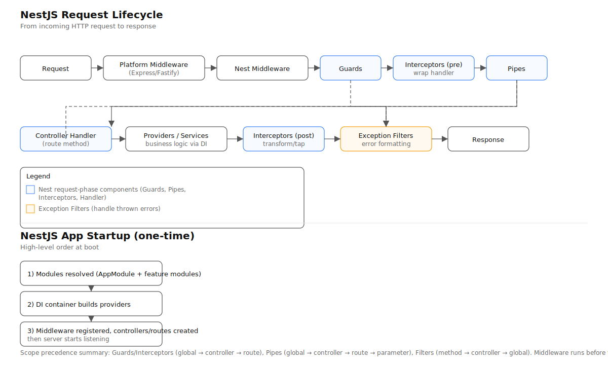

# NestJS execution flow

This diagram shows the app startup and per-request lifecycle used by NestJS:

Legend:
- Blue boxes: request-phase components (Guards, Pipes, Interceptors, Handler)
- Amber boxes: Exception Filters (handle thrown errors)
- Gray boxes: Infrastructure (Middleware, Response)

Notes:
- Middleware runs before Guards/Pipes/Interceptors and is not caught by exception filters.
- Scope precedence:
  - Guards / Interceptors: global → controller → route
  - Pipes: global → controller → route → parameter
  - Filters: method → controller → global
